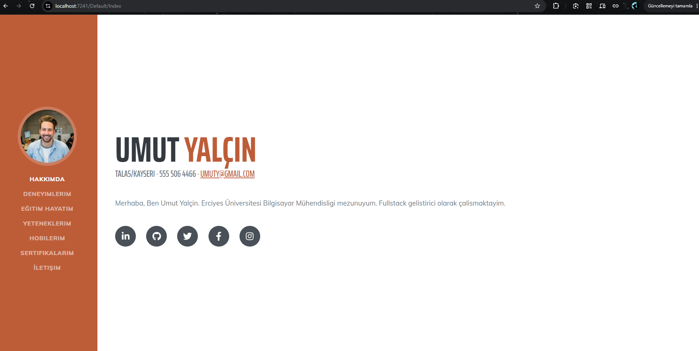
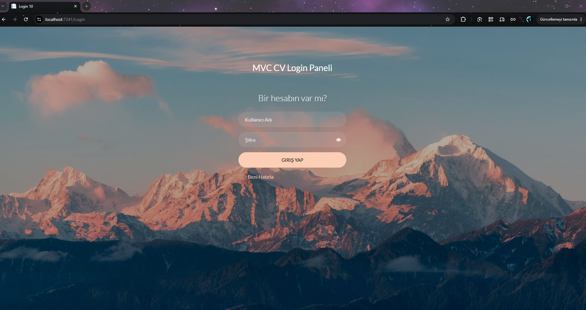
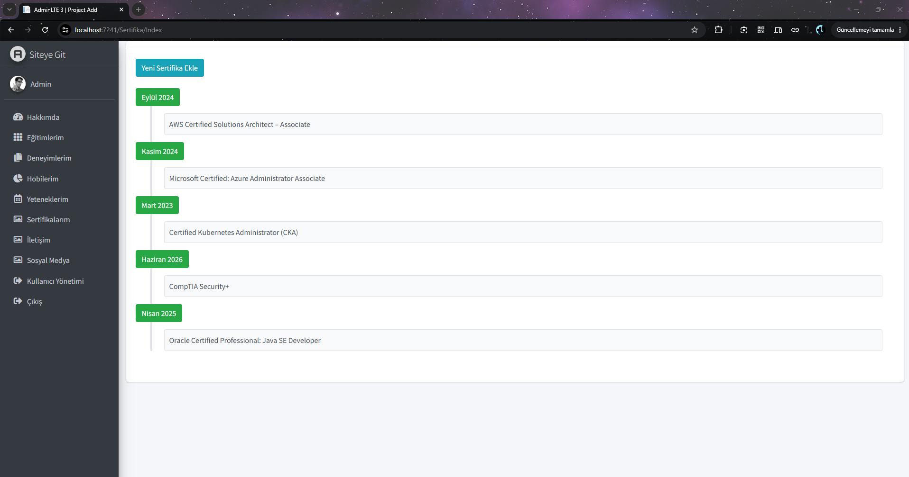
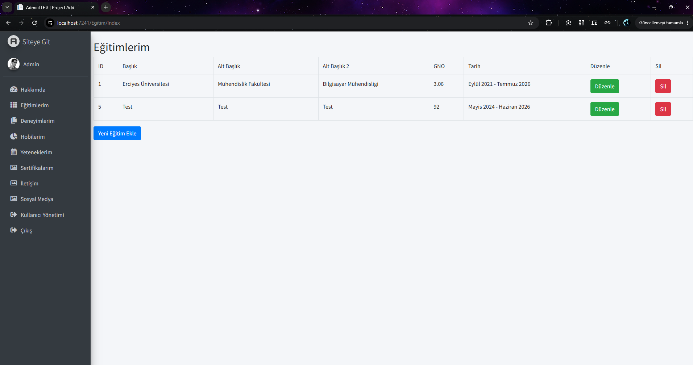

# MvcCv — Veritabanı Destekli Kişisel CV Sitesi

ASP.NET Core MVC ile geliştirilmiş, içeriğinin tamamı veritabanından beslenen kişisel
özgeçmiş sitesi ve yönetim paneli. Ziyaretçi tarafı bir CV sayfası, arka tarafı ise
sekiz bölümün tamamını yönetebileceğin korumalı bir admin panelidir.

> Bu bir **eğitim projesidir**. Öğrenme amacıyla geliştirildi; yayına alınmadan önce
> [Bilinen Eksikler](#bilinen-eksikler) bölümündeki maddelerin kapatılması gerekir.

---

## Ekran Görüntüleri

**Ziyaretçi tarafı — CV sayfası**
Tüm bölümler veritabanından gelir; her biri ayrı bir ViewComponent ile üretilir.



**Giriş ekranı**
Cookie tabanlı kimlik doğrulama, "beni hatırla" desteği ve hatalı girişte uyarı mesajı.



**Yönetim paneli — Sertifikalar**
AdminLTE 3 tabanlı panel. Sertifikalar zaman çizelgesi (timeline) görünümünde listelenir.



**Yönetim paneli — Eğitimler**
Klasik CRUD ekranı: listeleme, düzenleme ve silme.



---

## Özellikler

**Ziyaretçi tarafı**
- Hakkımda, deneyim, eğitim, yetenek, hobi, sertifika ve sosyal medya bölümleri —
  tamamı veritabanından gelir
- İletişim formu: gelen mesajlar veritabanına kaydedilir
- Her bölüm bağımsız bir **ViewComponent** ile üretilir

**Yönetim paneli**
- Cookie tabanlı kimlik doğrulama, "beni hatırla" ve `returnUrl` desteği
- Sekiz bölümün tamamı için yönetim ekranı + kullanıcı yönetimi
- Dört farklı yönetim kalıbı: tam CRUD · tek kayıt düzenleme · salt okunur liste ·
  soft delete'li CRUD
- Yetenekler için yüzdeye göre renklenen ilerleme çubuğu
- Sertifikalar için zaman çizelgesi görünümü
- Sosyal medya hesaplarında **soft delete** (kayıt silinmez, pasife çekilir)

---

## Teknolojiler

| Katman | Kullanılan |
|---|---|
| Framework | ASP.NET Core MVC (.NET 10) |
| Veri erişimi | Entity Framework Core 10 — **Database First** |
| Veritabanı | SQL Server (LocalDB) |
| Mimari | Generic Repository deseni |
| Kimlik doğrulama | Cookie authentication + `FallbackPolicy` |
| Ziyaretçi teması | Start Bootstrap — *Resume* |
| Yönetim teması | AdminLTE 3 |

---

## Mimari

```
Sunum        Controllers · ViewComponents · Views (.cshtml)
                              │
Veri erişimi     GenericRepository<T> ve türevleri
                              │
Veritabanı          AppDbContext (EF Core) → SQL Server
```

`GenericRepository<T>` CRUD metotlarını tek yerde toplar; her tablo için türetilmiş
bir repository sınıfı vardır. Controller'lar `DbContext`'i değil repository'yi tanır.

Kimlik doğrulamada **"varsayılan kilitli"** modeli kullanılır: `Program.cs` içindeki
`FallbackPolicy` tüm endpoint'leri kapatır, herkese açık olması gerekenlere
(`Default`, `Home`, `Login`) `[AllowAnonymous]` konur. Böylece yeni bir controller
eklendiğinde korumayı unutmak mümkün değildir.

---

## Kurulum

### Gereksinimler
- .NET 10 SDK
- SQL Server veya SQL Server LocalDB (Visual Studio ile birlikte gelir)
- Visual Studio 2022 ya da VS Code

### Adımlar

**1. Depoyu klonla**

```bash
git clone https://github.com/<kullanici-adin>/MvcCv.git
cd MvcCv
```

**2. Veritabanını oluştur**

SSMS ile `Database/script.sql` dosyasını çalıştır. Script `DbCv` veritabanını, dokuz
tabloyu ve ekran görüntülerinde görünen örnek verileri birlikte oluşturur. Veritabanı
dosyaları SQL Server'ın varsayılan konumuna yazılır; ek bir ayar gerekmez.

Örnek verideki e-posta adresleri `@example.com` uzantılıdır — bu alan adı tam olarak
bu amaç için ayrılmıştır, gerçek bir adrese gitmez.

**3. Bağlantı cümlesini kontrol et**

`MvcCv/appsettings.json`:

```json
"ConnectionStrings": {
  "DefaultConnection": "Server=(localdb)\\MSSQLLocalDB;Database=DbCv;Trusted_Connection=True;TrustServerCertificate=True;"
}
```

LocalDB kullanıyorsan değişiklik gerekmez. Farklı bir SQL Server örneği kullanıyorsan
`Server=` kısmını düzenle.

**4. Çalıştır**

```bash
cd MvcCv
dotnet run
```

| | Adres |
|---|---|
| Ziyaretçi sayfası | `https://localhost:7241` |
| Yönetim paneli | `https://localhost:7241/Login/Index` |

**Demo giriş bilgisi**

```
Kullanıcı adı : Admin
Şifre         : 1234
```

> Bu bilgiler yalnızca demo amaçlıdır ve script'teki örnek veriyle birlikte gelir.
> Gerçek bir ortamda kullanılmamalıdır — şifreler henüz hash'lenmiyor, bkz.
> [Bilinen Eksikler](#bilinen-eksikler).

---

## Proje Yapısı

```
MvcCv-GitHub/
├── MvcCv/                  uygulama
│   ├── Controllers/        12 controller — ziyaretçi, yönetim, giriş
│   ├── Models/
│   │   ├── AppDbContext.cs scaffold ile üretilen EF Core context
│   │   └── Entity/         her tablo için bir sınıf
│   ├── Repositories/       GenericRepository<T> + sekiz türev
│   ├── Views/
│   │   ├── Shared/         layout'lar ve ViewComponent görünümleri
│   │   ├── ViewComponents/ ViewComponent sınıfları
│   │   └── <Bölüm>/        her yönetim bölümünün ekranları
│   └── wwwroot/            statik dosyalar ve temalar
├── Database/script.sql     veritabanı + örnek veri
├── docs/                   ekran görüntüleri
└── MvcCv.slnx              solution dosyası
```

---

## Veritabanı

Dokuz tablo, aralarında ilişki yok — her biri bağımsız bir CV bölümünü besler.

| Tablo | İçerik |
|---|---|
| `TblHakkimda` | Kişisel bilgiler ve tanıtım metni |
| `TblDeneyimlerim` | İş deneyimleri |
| `TblEgitimlerim` | Eğitim geçmişi |
| `TblYeteneklerim` | Beceriler ve yüzde oranları |
| `TblHobilerim` | İlgi alanları |
| `TblSertifikalarim` | Sertifikalar |
| `TblSosyalMedya` | Sosyal medya hesapları (soft delete'li) |
| `Tbliletisim` | Ziyaretçi mesajları |
| `TblAdmin` | Yönetici hesapları |

Proje **Database First** yaklaşımıyla geliştirildi: tablolar SQL Server tarafında
oluşturuldu, C# sınıfları `Scaffold-DbContext` ile üretildi. Bu yüzden `Migrations`
klasörü yoktur.

---

## Bilinen Eksikler

Bu bölüm bilerek yazılmıştır: proje bir öğrenme sürecinin çıktısıdır ve aşağıdaki
maddelerin farkındayım. Yayına alınacak olsaydı sırasıyla bunlar kapatılırdı.

**Güvenlik**
- **Şifreler düz metin saklanıyor.** Hash'leme (BCrypt veya ASP.NET Core Identity)
  yapılmalı. Kolon `varchar` olduğu için şifre karşılaştırması ayrıca büyük/küçük
  harfe duyarsız.
- Silme işlemleri `GET` ile yapılıyor; `POST` + antiforgery token olmalı.
- `[ValidateAntiForgeryToken]` yalnızca birkaç yerde var.
- Son yönetici silinebiliyor — kalıcı kilitlenmeye yol açabilir.
- Rol ayrımı yok; giriş yapan her yönetici her şeyi yapabiliyor.

**Mimari**
- Repository'ler interface arkasına alınmadı (test edilebilirlik).
- Unit of Work yok; `SaveChanges` her repository metodunun içinde.
- Entity'ler doğrudan view'a ve action parametrelerine gidiyor — DTO/ViewModel kullanılmalı.
- Doğrulama `ModelState` yerine yer yer elle yapılıyor.

**Veri modeli**
- Deneyim ve eğitim tablolarında `Tarih` alanı metin olarak tutuluyor; tarihe göre
  sıralama ve aralık sorgusu yapılamıyor.
- Metin kolonları `varchar` — Türkçe karakterler veritabanı collation'ına bağımlı.

---

## Lisans

Bu projenin kaynak kodu MIT lisansı ile sunulmaktadır — bkz. [LICENSE](LICENSE).

Kullanılan üçüncü parti temalar kendi lisanslarına tabidir:
- **AdminLTE 3** — MIT (lisans dosyası `MvcCv/wwwroot/AdminLTE-3.0.4/LICENSE` içinde)
- **Start Bootstrap – Resume** — MIT
- **Login form şablonu** (`MvcCv/wwwroot/login-form-20`) — [Colorlib](https://colorlib.com/wp/templates/)
  tarafından ücretsiz sunulan bir şablon. Colorlib şablonları atıf (attribution)
  gerektirir; şablonun indirildiği sayfadaki güncel lisans şartlarını kontrol et.
